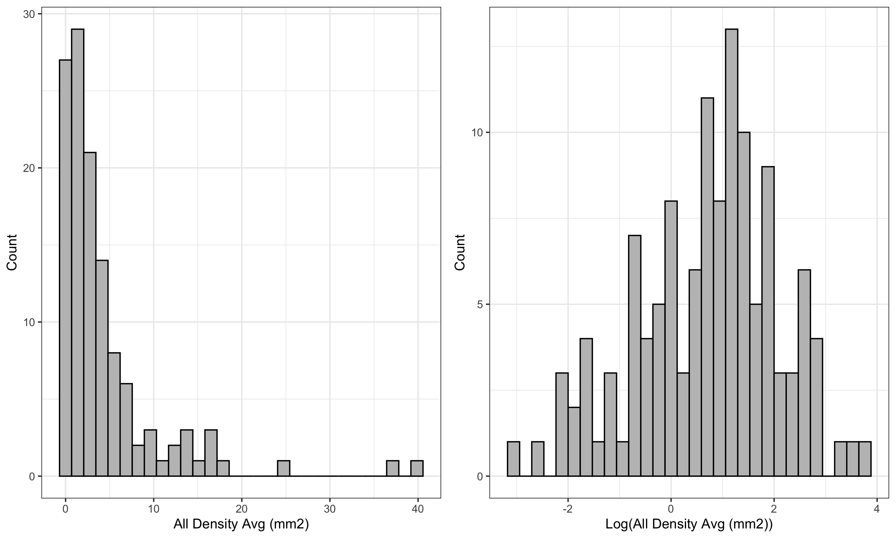
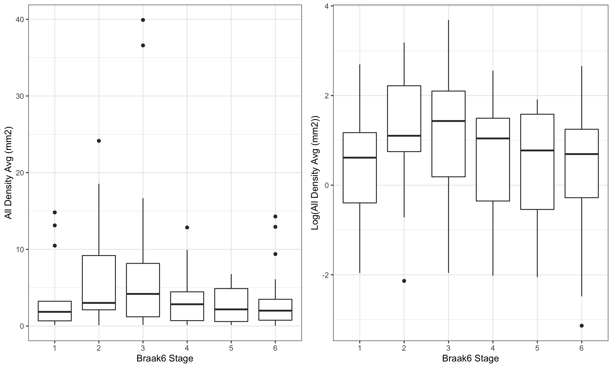
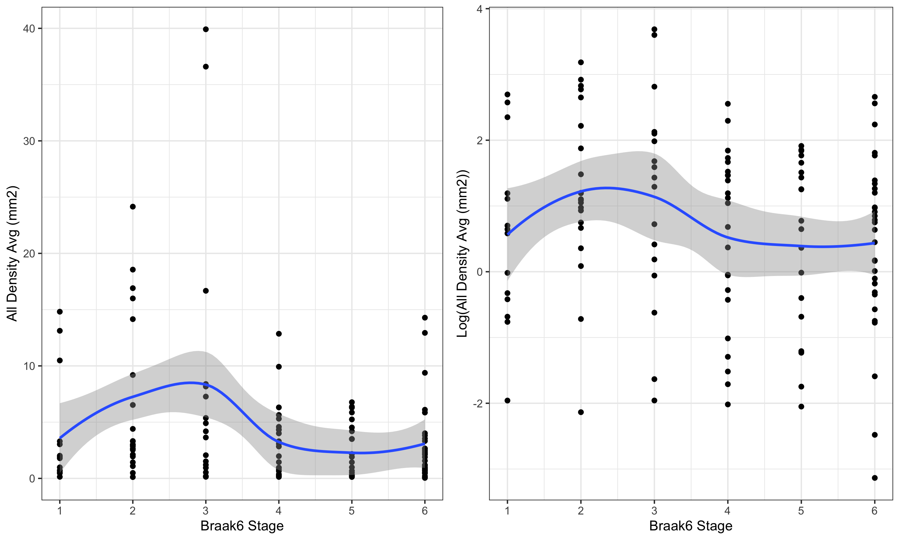

```{r setup, include=FALSE}
knitr::opts_chunk$set(echo = TRUE)
```

# Methods

## Statistical Analysis

Summary statistics including mean, standard deviation, median, interquartile range, and range were computed for the continuous variables. Absolute and relative frequencies were computed for the categorical variables. Box plots and scatter plots were constructed to descriptively evaluate the association between All Density Avg (mm2) and the Braak6 Stage Plots using the log scale for the outcome is also provided.

A generalized linear model with gamma distribution and log link was used to assess the association of Density Avg and Braak6 Stage, controlling for age (years), PMI (minutes), Cognitive Status, Sex, and Apoe Allele. Results are presented as mean ratios (MR) with confidence intervals (CI). 
All statistical analyses were performed in R version 4.0.2 (R Core Team, 2020). Complete case analysis was considered, with P < .05 determining statistical significance.

# Appendix

```{r, echo=FALSE, message=FALSE, warning=FALSE}

library(kableExtra)
library(tidyverse)
library(gt)
library(gtsummary)

```

```{r, echo=FALSE, message=FALSE, warning=FALSE}

# Running script
source("2 - Analysis.R")
source("2.2 - Analysis - Regression.R")

```

```{r, echo=FALSE, message=FALSE, warning=FALSE}

tab1_dem %>%
  as_flex_table()

```

 

 


 

AIC for all models evaluated: 
```{r, echo=FALSE, message=FALSE, warning=FALSE}

tab_aic 

```

### Results from final linear model with log(outcome):

```{r, echo=FALSE, message=FALSE, warning=FALSE}

tab_lm %>%
  as_flex_table()

```

**Interpretation**: A one unit variation in Braak06 stage leads to a 0.06 (95% CI: -0.14, 0.26) reduction on average in the mean of log density, keeping fixed the remaining variables.

### Results from final generalized linear model (gamma) with inverse link:

```{r, echo=FALSE, message=FALSE, warning=FALSE}

tab_glm %>%
  as_flex_table()

```

**Interpretation**: For Braak6 Stage <= 3, one unit variation of Braak06 leads to a 0.05 reduction on average in the inverse of mean of density.

For Braak6 Stage > 3, one unit variation of Braak06 leads to a 0.11 increase on average in the inverse of mean of density.

Note that a reduction (increase) in the inverse scale is equivalent to a increase (reduction) in the original scale.

### Results from final generalized linear model (gamma) with log link:

```{r, echo=FALSE, message=FALSE, warning=FALSE}

tab_glm_log %>%
  as_flex_table()

```

**Interpretation**: We have evidences that support that there is at least one statistically significant difference between the levels of Braak6 Stage (p = 0.006), with higher densities for stages 2 and 3 of Braak06 and lower densities for stages 4 to 6, when compared to stage 1.

From the ad-hoc comparison below, we see that there is a statitically significant difference between stage 3 versus 5.

Ad-hoc comparisons for generalized linear model (gamma) with log link:

```{r, echo=FALSE, message=FALSE, warning=FALSE}

tab_comp 

```
